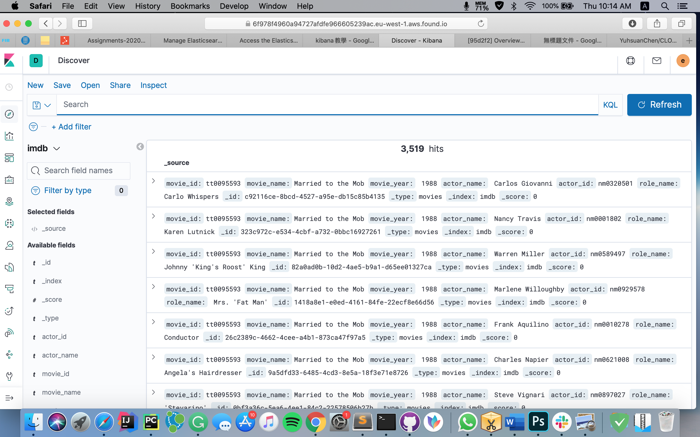
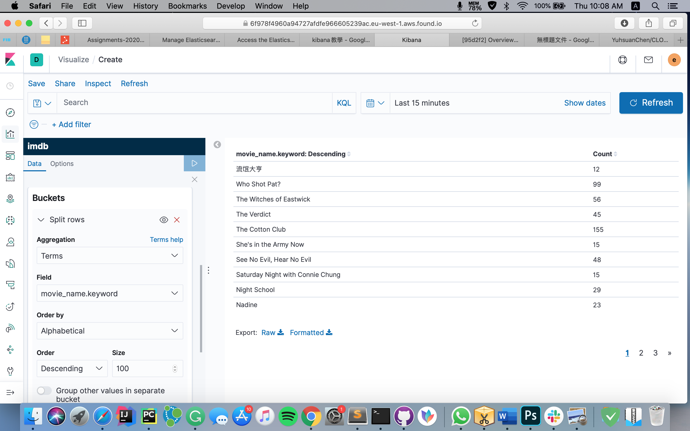
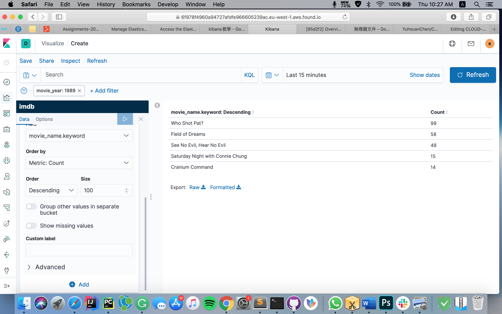
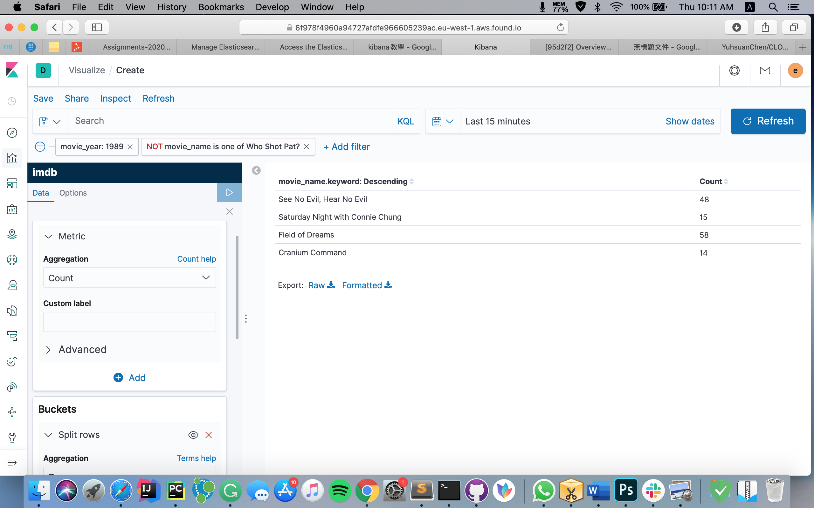
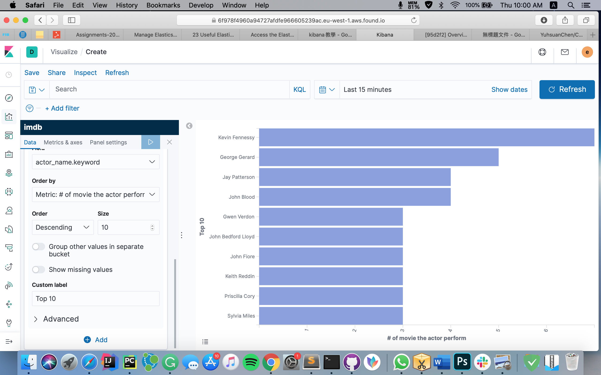
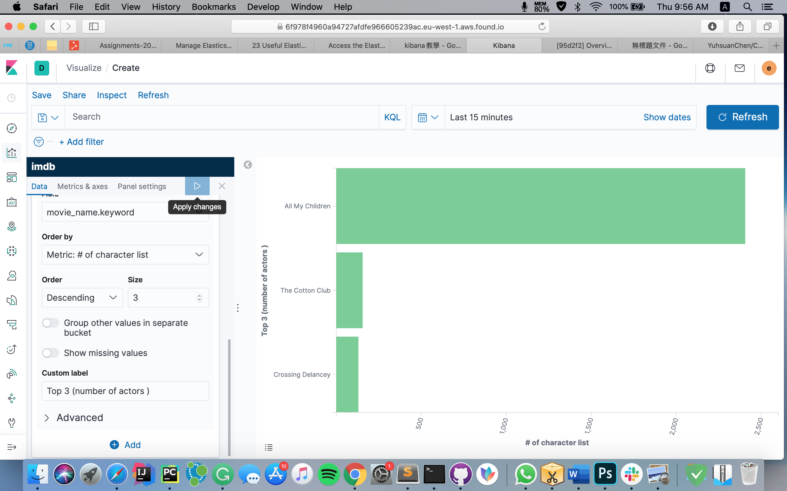
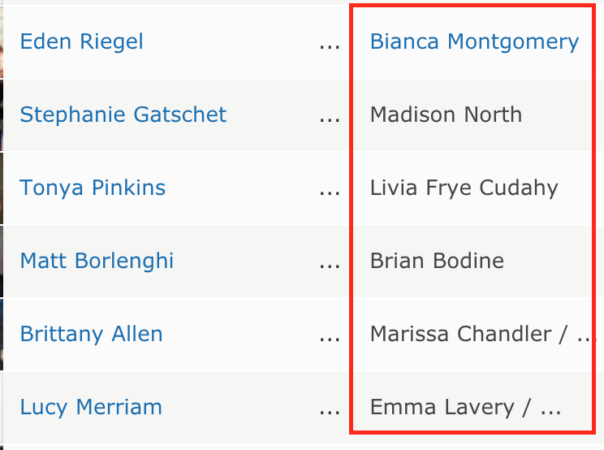
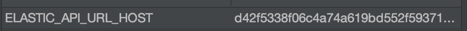

# CLOUD-COMPUTING-CLASS-2020-Lab6

## Q74: Explain what you have done in the README.md file of the Lab7 folder of your answers repository, add the new plot. Push the code changes to your scrapy-lab repository (30% of total grade for this lab session)

After setting up the credential and call es.index to add a new index to an Elasticsearch cluster, we can open Kibana to create the new index pattern call imdb. 
In the Kibana interface, we first click the discover tab to see the overview of our data and play around. 
 <p align="center"></p>

We can also check how different it is to apply filter.
First screenshot: without applying any filter, the result show more 3 pages of movie. 
<p align="center"></p>
Second screenshot: The filter on year was set to 1989 and 5 movies left as follow.
<p align="center"></p>
Third screenshot: Not only the previous filter was set, the filter on movie name also set.
<p align="center"></p>

We also play around with the polts
The first plot shows the top 10 actors that perform more movies than others.
 <p align="center"></p>

The second plot we check the top 5 movies that have the most significant amount of actor perform in it.
 <p align="center"></p>


## Q75: How long have you been working on this session? What have been the main difficulties you have faced and how have you solved them? 


I worked for more than 10 hours. During these 10 hours, I spend around 6 hours to output the data to JSON file successfully. 
There are two main difficulties I had here 
Design the format of extracting the data, some tags have the same name but are different fields. Notably, the role part, some character has link while some not, it took a while to figure out how to access it without mess the order.
 <p align="center"></p>

When trying to crawl another page by calling ```request = scrapy.Request(next_url, callback=self.parse_next_movie)``` It did not succeed as I thought, and it took me a while to find the solution to change to following line ```request = scrapy.Request(url, callback=self.parse_next_movie, dont_filter=True)```


The other problem that i had is when start using ElasticSearch. Not so sure what data the credential part to filled because on the website there are several. However, by keeping trying around them, it still not working. It did not work until I delete the https:// before the ELASTIC_API_URL_HOST

 <p align="center"></p>


